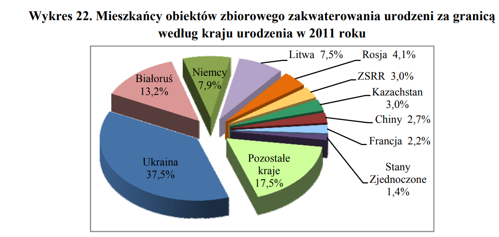

Poprawa wykresu : Mieszkańcy obiektów zbiorowego zakwaterowania urodzeni za granicą
według kraju urodzenia w 2011 roku.

Oryginalny wykres jest niepoprawny ponieważ:

- wykresy kołowe są z reguły nieczytelne

- 3 wymiar dodatkowo zaburza percepcję

## Oryginał


```{r setup, include=FALSE}
knitr::opts_chunk$set(echo = TRUE)
library(ggplot2)
library(dplyr)
```

## Stworzenie danych

```{r }
values <- c(37.5, 17.5, 13.2, 7.9, 7.5, 4.1, 3.0, 3.0, 2.7, 2.2, 1.4)
countries <- c('Ukraina', 'Pozostałe kraje', 'Białoruś', 'Niemcy', 'Litwa', 'Rosja','ZSRR','Kazachstan','Chiny','Francja','Stany Zjednoczone')
df <- data.frame(countries = countries, values = values)
```

## Plot

```{r}
ggplot(df, aes(x = factor(countries, levels = rev(countries)), y = values, fill = values)) +
  geom_bar(stat='identity') +
  geom_text(aes(label = paste0(values,'%')), hjust=-0.5) + 
  coord_flip() + 
  scale_fill_gradient(low = 'blue', high = 'red') + 
  scale_x_discrete(name = 'Państwo pochodzenia') + 
  scale_y_continuous(name = 'Procent mieszkańców', lim = c(0,42)) + 
  theme_bw() +
  theme(legend.position = "none") +
  ggtitle('Mieszkańcy obiektów zbiorowego zakwaterowania urodzeni za granicą')
```

