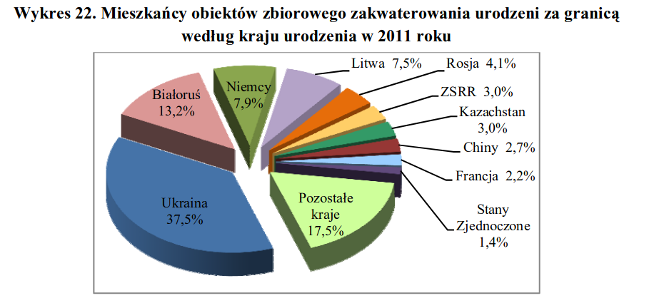

```{r setup, include=FALSE}
knitr::opts_chunk$set(echo = TRUE)
```

## Oryginalny wykres

Źródło: https://stat.gov.pl/download/cps/rde/xbcr/gus/LUD_ludnosc_stan_str_dem_spo_NSP2011.pdf 124/337



### Co jest źle?

* Wykres kołowy 3D. Wprowadzona perspektywa nie pozwala ocenić wielkości poszczególnych części nie patrząc na podpisy.  

## Dane

```{r}
library(DT) 
x <- c(37.5, 13.2, 7.9, 7.5, 4.1, 3, 3, 2.7, 2.2, 1.4, 17.5)
y <- c('Ukraina', 'Białoruś', 'Niemcy', 'Litwa', 'Rosja', 'ZSRR', 'Kazachstan', 'Chiny', 'Francja', 'Stany Zjednoczone', 'Pozostałe')
id <- 1:length(x)
df <- data.frame(id=id, country=y,fraction=x)
datatable(df,rownames = FALSE)
```

## Poprawiony wykres

```{r warning=FALSE,message=FALSE,echo=FALSE}
library(ggplot2)
library(dplyr)


specify_decimal <- function(x, k) trimws(format(round(x, k), nsmall=k))
bold11 <- element_text(size=11,face='bold')
bold10 <- element_text(size=10,face='bold')

country_order = rev(factor(y, levels = y[order(x, decreasing=FALSE)]) %>% 
  relevel("Pozostałe"))

ggplot(data=df, aes(x=country,y=fraction)) + 
  geom_bar(stat='identity',fill='#e9cc7f') +
  geom_text(aes(label=specify_decimal(fraction,1)),hjust=0) +
  scale_y_continuous(limits=c(0,40)) +
  scale_x_discrete(limits = country_order) +
  coord_flip() +
  labs(y='Procent całości', x=' ',caption='',title='Podział zakwaterowania osób\nurodzonych za granicą',subtitle='według kraju urodzenia w 2011 roku') + 
  theme(
    plot.title = element_text(hjust=0.5),
    plot.subtitle=element_text(hjust=0.5),
    legend.title = bold11,
    axis.title.x = bold11,
    axis.text = bold10
  )
```

### Co zostało poprawione
* Zmieniono geometrię wykresu z wykresu kołowego na wykres słupkowy.
* Wyszczególniono zagregowane dane: przesunięto grupę 'Pozostałe' na sam dół, co zmusza czytelnika do zastanowienia się czemu, ta pozycja jest na dole. A jest na dole, bo zawiera zagregowaną grupę państw. Na wykresie kołowym można byłoby błędnie odczytać, że 'Pozostałe' jest jakimś dużym państwem.
* Przesunięto podpisy poza słupek. Na wykresie kołowym podpis mógł być trudny do odczytania ze względu na kolor kawałka, na którym się napisał znajdował oraz kolor napisu. W przypadku Ukrainy jest to czarny kolor tekstu na ciemno niebieskim tle.
* Można byłoby poprawić ilość wyświetlanych danych w tabelce z danymi. Obecna domyślna paginacja z ilością elementów 10 powoduje to, że są dwie strony rekordów. Ale nie udało mi się tego poprawić.
