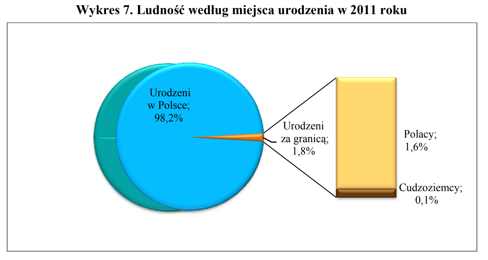

# Wykres oryginalny



# Wykres poprawiony

Zmieniono wykres eksplodowany wykres kołowy na wykres waflowy.
Usunięto "eksplodowanie"
Uzupełniono dane dodając "Brak danych" dla 0.1% 

```{r,include=TRUE}
library(devtools)
library(waffle)
parts <- data.frame(
  names = c('Polacy urodzeni \nw Polsce (98.2%)', 'Polacy urodzeni \nza granicą (1.6%)', 'Cudzoziemcy urodzeni \nza granicą (0.1%)', 'Brak danych (0.1%)'), 
  vals = c(982, 16, 1, 1)
)
waffle(parts, rows = 20, colors = c("lightblue", "red", "black", "grey"),
       title="Ludność według miejsca urodzenia w 2011 roku", size = 0.5,
       legend_pos = "bottom")
```