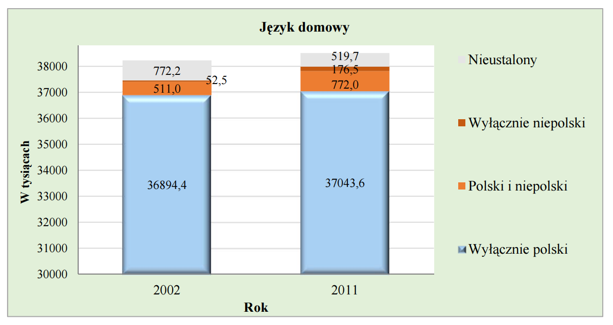

```{r setup, include=FALSE}
knitr::opts_chunk$set(echo = TRUE)
```

## Opis zadania

Z raportów NSP wybierz wykres, który Twoim zdaniem można poprawić. Następnie, w podfolderze z folderu W3 odpowiednim dla Twojej grupy umieść folder NazwiskoImie, a w nim plik .Rmd i jego skompilowaną wersję w formacie .html. Plik ma zawierać oryginalny wykres, poprawiony wykres wykonany w ggplot2 oraz opis co zostało poprawione i dlaczego.

## Rozwiązanie

Wybrano wykres dotyczący języków używanych w kontaktach domowych w Polsce. Oryginalny wykres w raporcie wyglądał następująco:



Aspekty, które można poprawić:

* Trudno jest porównać dane dotyczące pojedyńczego roku oraz dotyczące różnych lat, przykładowo porównanie słupków dla kategorii "Polski i niepolski" jest bardzo trudne, ponieważ rozpoczynają się od różnych wysokości.

* Dodatkowo ułozenie słupków na sobie powoduje, że wartości dla kategorii "Niepolski" są zupełnie niewidoczne dla roku 2002.

* Kolory w legendzie zostały dobrane nieodpowiednio, ponieważ kolor szary dla kategorii "Nieustalony" zlewa się z kolorem tła.

* Opis osi OY mógłby być bardziej dokładny

* rozpoczęcie od osi OX od wartości 30000 jest mylące

* Kolor dotyczący kategorii "Wyłącznie polski" nie jest jednolity, co powoduje złudzenie optyczne, że słupek jest "bardziej masywny"

```{r}
library(dplyr)
library(tidyr)
language_data <- read_csv("data.csv")

language_data <- language_data %>% 
  filter(Język != "Wyłącznie Polski") %>% 
  gather(Rok, Ludność, c("2002", "2011"))


ggplot(language_data, aes(x = Rok, y = Ludność, fill = Język)) +
  geom_bar(stat = "identity", position = "dodge") +
  scale_y_continuous(labels = function(x) sprintf("%s tys.", x))

```

Zrezygnowano z wyświetlania wartośći dla kategorii "Wyłącznie Polski", ponieważ duże wartości w tej kategorii powodowały, że inne wartości były niewidoczne.